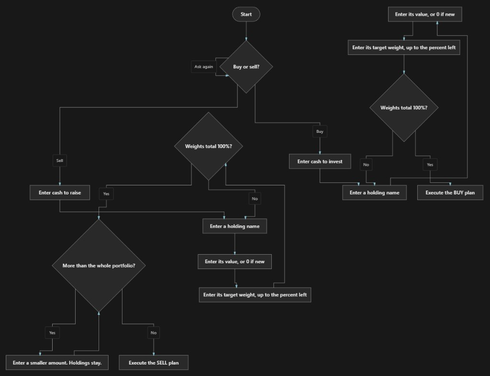

# Simple Portfolio Rebalancer

A portfolio rebalancer that works in one direction at a time. It asks whether you want to rebalance by buying or by selling, then builds a plan.

Buy-only takes cash you want to invest and allocates it to the holdings that are furthest below their target weights. It never sells.

Sell-only raises cash by selling the holdings that are furthest above their target weights. It never buys.

## Schematic



## How to run

**Option A – Plain Python (no dependencies)**

```
python PortfolioRebalanceCalculator.py
```

You can also copy the contents of `PortfolioRebalanceCalculator.py` into any online Python IDE.

**Option B – Jupyter Notebook**

1. Install Jupyter: `pip install -r requirements.txt`
2. Open `PortfolioRebalanceCalculator.ipynb` in Jupyter, VS Code, or Cursor.
3. Run the cell.

You will be asked whether to rebalance by buying or selling (`buy` or `sell`).

Buy-only then asks for:

- Available cash to invest
- Each position’s name, current market value (use `0` if you do not own it yet), and target weight in percent

Sell-only asks for the amount to raise by selling, then the same position details. If that amount is larger than the portfolio, you are asked for a smaller one. Positions you already entered stay in place.

Keep adding positions until the target weights sum to 100%. The program then prints how much to buy or sell of each asset.

## License

MIT
